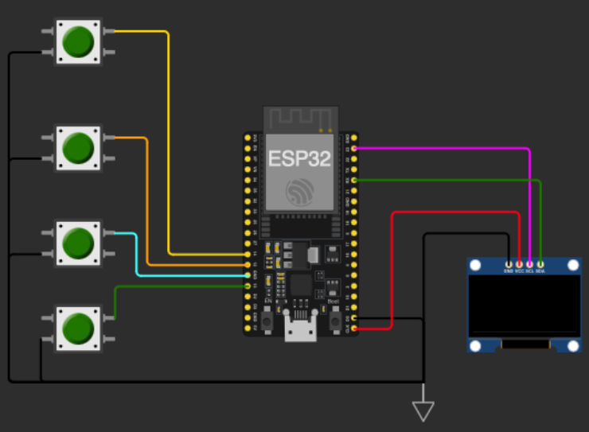

# TECHIN515 Lab 3: ESP32 Sorting Hat

## Overview

In this lab, you will build a magical sorting hat using an ESP32 and machine learning. The sorting hat will classify students into different houses based on their characteristics. You will collect data, train and rigorously evaluate a decision tree classifier, and deploy it on an ESP32 with buttons and an OLED display.

## Learning Objectives

- Wire push buttons with `INPUT_PULLUP` and implement software debouncing on ESP32
- Collect and preprocess a labeled dataset for multi-class classification
- **Evaluate and compare ML models** using cross-validation, confusion matrices, and feature importance analysis
- **Justify model selection** for edge deployment based on accuracy, model size, and hardware constraints
- Deploy a trained decision tree on ESP32 via `micromlgen`

## Hardware Requirements

- ESP32 development board
- 4 push buttons
- OLED display (Adafruit SSD1306)
- USB cable
- Breadboard and jumper wires

## Software Requirements

- Arduino IDE or PlatformIO
- ESP32 board support package
- Required Arduino libraries:
  - Adafruit SSD1306
  - Adafruit GFX Library
- Python dependencies defined in `requirements.txt`

## Project Structure

```
.
├── src/
│   ├── sorting_hat_laptop.py          # Minimal train-and-export script
│   ├── sorting_hat_evaluation.ipynb   # Model evaluation notebook
│   ├── dataset.csv                    # Your dataset
│   └── requirements.txt               # Python dependencies
├── sorting_hat_ESP32/
│   ├── sorting_hat_esp_button_64_width.ino   # ESP32 sketch (128x64 OLED)
│   └── sorting_hat_esp_button_32_width.ino   # ESP32 sketch (128x32 OLED)
├── assets/
│   └── sorting_hat_button.png         # Wiring diagram
└── README.md
```

## Dataset Structure

The dataset is stored in a CSV file with the following structure:

| Question 1 | Question 2 | Question 3 | ... | House |
|------------|------------|------------|-----|-------|
| 1          | 3          | 2          | ... | Gryffindor |
| 2          | 1          | 4          | ... | Slytherin |
| 3          | 2          | 1          | ... | Hufflepuff |
| 4          | 4          | 3          | ... | Ravenclaw |

### Features

- Each question column contains integer values (1-4) representing the user's response
- The `House` column contains the target variable (Gryffindor, Slytherin, Hufflepuff, or Ravenclaw)
- Each row represents one student's complete set of responses

### Data Collection Guidelines

- Collect at least 50 entries (5 responses from 10 different students)
- Ensure **balanced representation** across all houses
- Each response should be a number between 1 and 4
- Label each complete set of responses with the appropriate house
- Ensure consistent house name spelling (case-sensitive). The label `Gryffindor` is different from `gryffindor`.
- Your dataset must have exactly **10 question columns** (`Question 1` through `Question 10`), matching the 10 questions in the Arduino sketch

## Tasks

### Task 1: Data Collection

Create your dataset to train the sorting hat.

1. Create at least five responses to all questions and label them.
2. Talk to other students, and collect responses generated by at least five other students. This should give you at least 50 entries in the dataset. You are encouraged to collect more data as you can.


### Task 2: Environment Setup

Navigate to `src` directory. Create a virtual environment, activate it, and install the required libraries.

For MacOS:

```bash
python3 -m venv .venv

source .venv/bin/activate

pip install -r requirements.txt
```

For Windows:

```bash
python -m venv .venv

.venv/Scripts/Activate

pip install -r requirements.txt
```

After installation, launch Jupyter to work with the evaluation notebook:

```bash
jupyter notebook sorting_hat_evaluation.ipynb
```

### Task 3: The Sorting Trials — Model Evaluation

Open `src/sorting_hat_evaluation.ipynb` in Jupyter and work through all 6 sections. Complete checkpoint questions as you go. The notebook guides you through:

1. **Load & Explore Data** — Load your CSV, visualize class distribution, check for imbalance
2. **Baseline Model & Cross-Validation** — See why a single train/test split is unreliable; use 5-fold CV for robust accuracy estimation
3. **Hyperparameter Tuning** — Sweep `max_depth` from 1 to 15, plot training vs. CV accuracy, identify the overfitting point
4. **Feature Importance & Reduction** — Discover which questions matter most, test whether you can drop the least important ones
5. **Model Comparison** — Compare Decision Tree, Random Forest, KNN, and SVM using CV accuracy, confusion matrices, and ESP32 compatibility
6. **Edge Deployment Analysis & Export** — Measure model sizes, visualize the accuracy-size tradeoff, export your final `sorting_hat_model.h`

After completing the notebook, copy `sorting_hat_model.h` into the `sorting_hat_ESP32/` directory.

### Task 4: Hardware Assembly

Wire your ESP32 with buttons and OLED display. An example is shown in the figure below. Update the sketch `sorting_hat_esp_button_x_width.ino` accordingly, depending on how you wire the sorting hat and which OLED display you use. If your OLED display is 128x64, choose `x=64`. If your OLED display is 128x32, choose `x=32`.



### Task 5: Implement `checkButtons()`

The starter code includes a function stub for checking button presses and recording responses. Your task is to implement the following:

- Wait for **exactly one** of the 4 buttons to be pressed
- Store the response as an integer (1–4) in the `responses[]` array
- Debounce the input
- Call the `nextQuestion()` function once an answer is recorded

The pseudocode is as follows:

```cpp
// Pseudocode:
if (buttonStates[i] == LOW) { // If the button is pressed (LOW because of INPUT_PULLUP)
   // Save the user's answer

   // Note that a button was pressed
}

if (buttonPressed) { // If any button was pressed (and debounced), move to next question

 }
```

Hints:
- Look for LOW when the button is pressed.
- Change PIN numbers based on your wiring and board being used.

### Task 6: Integration Testing

Test the full pipeline end-to-end:

1. Upload the sketch with your exported model to the ESP32
2. Press buttons to answer all 10 questions and verify the house assignment appears
3. Try known answer patterns (e.g., all A's should lean toward a particular house)
4. Compare ESP32 predictions against the notebook's predictions for the same inputs
5. Document any discrepancies between notebook and ESP32 results

## Discussion Questions

Answer the following questions with **quantitative evidence** from your evaluation notebook (include accuracy numbers, plots, and tables).

1. **Feature Analysis**: Based on your feature importance plot, list the top 3 and bottom 3 questions by importance score. You removed the 3 least important features and retrained. Report: (a) original CV accuracy with all 10 features, (b) CV accuracy with 7 features, (c) size difference in generated C++ code. Would you deploy the 7-question model? Justify.

2. **Model Selection**: Complete this comparison table from your notebook (Decision Tree, Random Forest, KNN, SVM). For each: CV accuracy (mean +/- std), whether it can be converted to C++ for ESP32, and .h file size if applicable. Which model did you deploy and why? Consider accuracy, memory constraints, interpretability, and inference speed.

3. **Depth Tradeoff**: Include your accuracy vs. depth plot. At what depth does overfitting begin? What is the relationship between tree depth and generated model size? What depth did you choose for deployment and why?

4. **Reflection**: If you were to add a new sensor (e.g., heart rate, grip strength) to the sorting hat, how would you incorporate it into your pipeline? Would your chosen model type still be appropriate? What evaluation steps would you repeat?

## Deliverables

Submit a GitHub repository containing:

1. **Video** of your working sorting hat prototype
2. **Dataset** (CSV file with 30+ entries)
3. **Evaluation notebook** (`sorting_hat_evaluation.ipynb`) with all sections completed, plots generated, and checkpoint questions answered
4. **Arduino source code** with comments
5. **Written responses** to discussion questions with quantitative evidence (accuracy numbers, plots, tables)
