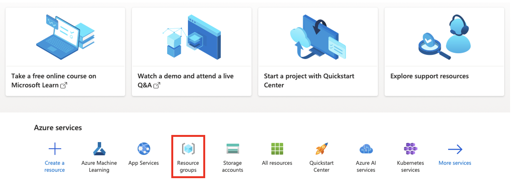
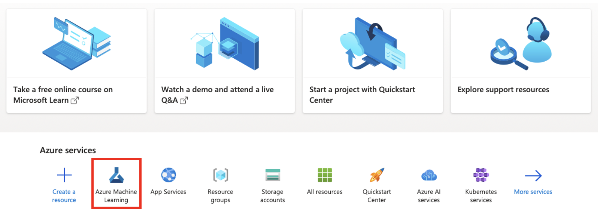
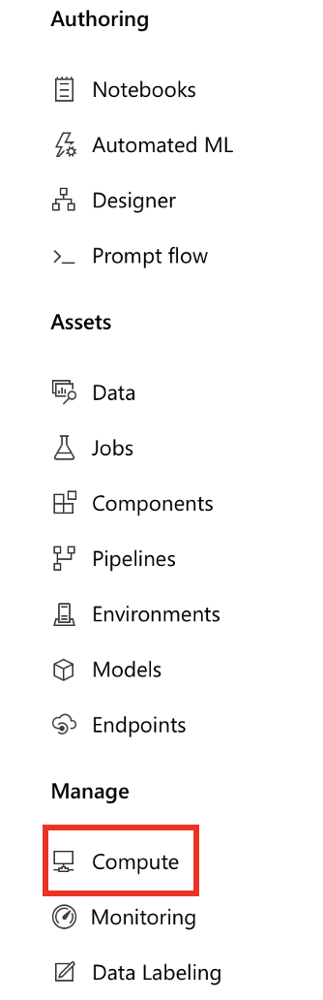

# TECHIN 515 Lab 5 - Edge-Cloud Offloading

This project builds upon Lab 4. You will implement an edge-cloud offloading strategy: the ESP32 performs gesture inference locally and offloads raw sensor data to a cloud server when local confidence is low.

The outline of this lab is as follows:

- Deploy a pre-trained gesture model as a Flask REST API
- Configure the magic wand to offload to the cloud when uncertain
- Evaluate the accuracy-latency-bandwidth tradeoffs with quantitative evidence

> **Note:** Steps 1-4 set up Azure infrastructure. If you only plan to run the Flask server locally (recommended for getting started quickly), skip to Step 5.

## Learning Objectives

By completing this lab, students will:

1. Deploy a pre-trained model as a REST API endpoint using Flask
2. Implement confidence-based edge-cloud offloading on ESP32
3. Measure and compare local vs. cloud inference latency
4. Optimize the confidence threshold using experimental data
5. Evaluate accuracy-latency-bandwidth tradeoffs with quantitative evidence

## Hardware Requirements

- Your magic wand from Lab 4

## Software Requirements

### Arduino IDE

- Arduino IDE with ESP32 board support
- Required libraries:
  - Adafruit MPU6050
  - Adafruit Sensor
  - Wire 
  - WiFi 
  - HTTPClient 
  - ArduinoJson
  - Your Edge Impulse library from Lab 4

### Microsoft Azure account (optional for local-only setup)

### Python (for server and evaluation)

- Python 3.8 or newer
- Required packages: see `app/requirements.txt` and `evaluation/requirements.txt`

## Getting Started

### 1. Azure Resource Group

1. Navigate to [Microsoft Azure](https://azure.microsoft.com/en-us/) and sign in with your account. If you are new to Azure, you should get $200 free trial credit.
2. Click on `Resource groups` as shown below to create a resource group.



3. Name your resource group, e.g., TECHIN515-lab, and choose the closest region, e.g., West US 2. Click `Review+Create`, then `Create` to create the resource group. You can use the default subscription "Azure subscription 1".
   - You would like to have the region close to your location to reduce latency.

### 2. Azure ML Workspace

1. Navigate back to homepage by clicking on Microsoft Azure on top left, or use this [link](https://portal.azure.com).
2. Click on `Azure Machine Learning` as shown below.



3. Click on `+Create` to create an AzureML workspace.
   - Use default subscription, i.e., Azure subscription 1
   - Attach the workspace to the resource group you just created
   - Name your workspace, e.g., TECHIN515-lab
   - Use the same region as your resource group
   - Leave storage account, key vault, and application insights as default
4. Click on `Review+Create`, then `Create` to create the workspace.

### 3. Compute Instance

There are two types of compute in AzureML: Compute instance and compute cluster. The former is used for development and the latter is used for scalable training jobs.
In the following, we will create a compute instance.

1. Go to your ML workspace, launch ML studio, and click on `Compute` in the left sidebar.



2. Choose the `Compute Instances` tab, and click `+New`.
3. Fill in name, virtual machine size, and region. Note that the region should match that of your workspace.
4. Click `Create`. It may take a few minutes to create the compute instance.

### 4. Host Data

1. Locate the training data on your laptop. We will host the data in Azure Blob. Note that as the cloud has higher computing performance and more storage, you can merge your training data with that collected by other students to improve your model performance.
2. Go to AzureML and navigate to Data tab. Click `+Create`.
3. Name your data asset along with a brief description. Choose `Folder (uri_folder)` as type. Click `Next`.
4. Choose From local files option, and upload your training dataset. Click `Next`.
5. Leave datastore type as Azure Blob storage and click `Next`.
6. Upload your training dataset folder. Click `Next` and then `Create`.

### 5. Deploy the Flask Server

The Flask server hosts your trained gesture model and exposes a `/predict` REST endpoint.

1. Navigate to the `app/` directory. Add your `wand_model.h5` there.
2. Create a virtual environment and install dependencies:

   ```bash
   cd app
   python -m venv .venv
   source .venv/bin/activate   # On Windows: .venv\Scripts\activate
   pip install -r requirements.txt
   ```

3. **Important:** Open `app.py` and update `gesture_labels` to match the classes your model was trained on, in the same order used during training.

4. Start the server:

   ```bash
   python app.py
   ```

   You should see output indicating the server is running on `http://0.0.0.0:8000`.

5. Verify the server is working:

   ```bash
   python test_app.py
   ```

   You should see a JSON response with a `gesture` label and `confidence` percentage. Example:
   ```json
   {"confidence": 42.3, "gesture": "V"}
   ```

6. You can deploy the Flask app to Azure App Services for remote access. Note that this option is subject to cost, especially when hosting large ML models. Once the model is deployed, make sure IP is changed accordingly.

### 6. ESP32 Offloading

A starter sketch is provided in `ESP32_offloading/ESP32_offloading.ino`. This sketch extends Lab 4's `wand.ino` with WiFi connectivity and HTTP-based cloud offloading.

1. Open `ESP32_offloading/ESP32_offloading.ino` in Arduino IDE.

2. Complete the **three TODO items** in the sketch:
   - **TODO 1:** Set your WiFi credentials (`WIFI_SSID`, `WIFI_PASSWORD`) and `SERVER_URL` (the IP address of the machine running the Flask server, e.g., `http://192.168.1.100:8000/predict`)
   - **TODO 2:** Add LED actuation for the local inference path (high confidence)
   - **TODO 3:** Add LED actuation for the cloud inference path

3. Upload the sketch to your ESP32. The serial monitor will show one of these output patterns:

   - **Local inference** (confidence >= threshold):
     ```
     LOCAL_INFERENCE: V (92.3%) latency=12ms
     ```
   - **Cloud offloading** (confidence < threshold):
     ```
     OFFLOAD_TO_CLOUD: V (62.1%) -> sending to server
     CLOUD_INFERENCE: V (88.7%) latency=234ms
     ```

4. The default `CONFIDENCE_THRESHOLD` is set to 80%. You will optimize this value in the evaluation step.

5. **Note on ArduinoJson:** The starter sketch uses ArduinoJson v7 (`JsonDocument`). If you have ArduinoJson v6 installed, update to v7 via Library Manager, or replace `JsonDocument` with `DynamicJsonDocument<1024>`.

### 7. Automated Testing

The `evaluation/test_offloading.py` script sends gesture feature vectors to the Flask server and records predictions, confidence, and latency for analysis.

1. Install evaluation dependencies:

   ```bash
   cd evaluation
   pip install -r requirements.txt
   ```

2. Make sure the Flask server is running (Step 5), then run:

   ```bash
   python test_offloading.py --server http://localhost:8000
   ```

   This generates `offloading_results.csv` with columns: `true_label`, `local_prediction`, `local_confidence`, `local_latency_ms`, `cloud_prediction`, `cloud_confidence`, `cloud_latency_ms`.

3. If you have gesture data from Lab 4, you can use it instead of synthetic data:

   ```bash
   python test_offloading.py --server http://localhost:8000 --data-dir ../data
   ```

4. **Note:** Local inference results are simulated (the Edge Impulse model cannot run on a laptop). Students who capture real ESP32 serial output can substitute those values in the CSV.

### 8. Evaluation Notebook

Open `evaluation/offloading_evaluation.ipynb` in Jupyter and complete all 6 sections:

```bash
jupyter notebook evaluation/offloading_evaluation.ipynb
```

| Section | Topic | Key Output |
|---------|-------|------------|
| 1 | Load & Explore Results | Dataset overview, latency statistics |
| 2 | Threshold Sweep & Offload Rate | Three-panel plot, optimal threshold selection |
| 3 | Confusion Matrices | Side-by-side comparison: Local vs. Cloud vs. Hybrid |
| 4 | Latency Distribution | Histograms, box plots, P95/P99 statistics |
| 5 | Bandwidth & Cost Estimation | Monthly data transfer calculation |
| 6 | Summary | Final recommendation with quantitative evidence |

Complete all `# YOUR CODE HERE` cells and answer all **Checkpoint** questions.

### 9. Clean Up Resources (**Important**)

1. If you have completed this lab and do not need the resources any more, go to resource groups from the portal menu and delete your resource group. This operation may take a few minutes to complete. Cleaning up resources will help manage your bills incurred when using cloud services.

## Discussion Questions

Answer the following questions with quantitative evidence from your evaluation notebook.

1. **Threshold Selection:** At what confidence threshold does offloading improve overall accuracy? Report the threshold, offload rate, and accuracy gain over pure-local inference. Include your threshold sweep plot.

2. **Latency Budget:** Report mean and P95 latency for local vs. cloud inference. At your chosen threshold, calculate the expected average latency per prediction. Show the calculation.

3. **Bandwidth Estimation:** If your wand performs 10 gestures/minute at your chosen threshold, estimate monthly data transfer. Show calculations using your measured offload rate and feature vector size.

4. **Architecture Tradeoff:** Based on your confusion matrices, are there specific gesture classes that benefit more from cloud offloading? Which ones and why? What are the privacy implications of sending raw sensor data to a cloud server?

## Deliverables

1. GitHub repository containing:

```
.
├── ESP32_offloading/                   # ESP32 Arduino code
│   └── ESP32_offloading.ino            # Main ESP32 sketch with offloading
├── app/                                # Web app for model deployment
│   ├── wand_model.h5                   # Trained model
│   ├── app.py                          # Flask server
│   ├── test_app.py                     # Server test script
│   └── requirements.txt                # Server dependencies
├── evaluation/                         # Evaluation pipeline
│   ├── test_offloading.py              # Automated test script
│   ├── offloading_results.csv          # Raw test results
│   ├── offloading_evaluation.ipynb     # Completed evaluation notebook
│   └── requirements.txt                # Evaluation dependencies
└── data/                               # Training data directory
    ├── O/                              # O-shape gesture samples
    ├── V/                              # V-shape gesture samples
    ├── Z/                              # Z-shape gesture samples
    └── some_class/                     # Other gesture samples
```

2. Evaluation notebook exported as PDF with all checkpoint questions answered
3. Written responses to discussion questions with quantitative evidence
